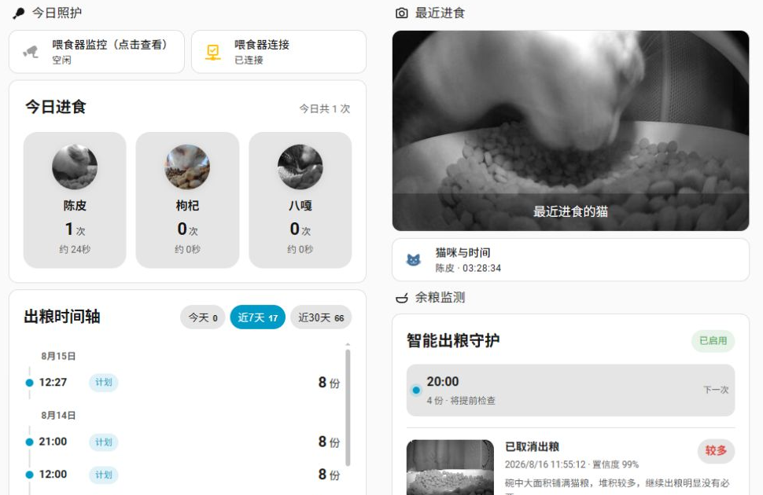
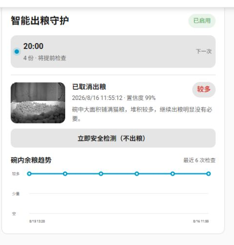
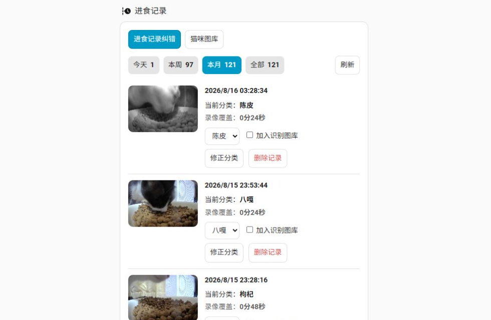

# Meoof Pet Feeder for Home Assistant

觅凹联网自动喂食器的 Home Assistant 自定义集成，目前实机验证型号为觅凹蛋卷（单粮仓）。通过手机号验证码登录，发现账号下的设备，并提供设备状态、喂食与觅食历史、实时画面、录像下载、猫咪档案以及可选的外部视觉识别。仓库同时内置 Lovelace 卡片，安装集成后无需再复制 JavaScript 文件。



> [!IMPORTANT]
> 这是非官方社区项目，与觅凹品牌方没有隶属、授权或背书关系。云端和局域网协议都可能随官方固件或服务升级而变化；启用真实设备动作前请阅读安全说明。

## 项目状态

| 项目 | 当前状态 |
| --- | --- |
| Home Assistant 实机运行 | 已验证 |
| 手机号验证码登录、设备发现 | 已验证 |
| 状态、历史、卡片、猫咪档案 | 已验证 |
| 智能余粮检测与单次计划抑制 | 已验证，默认关闭且失败时继续出粮 |
| HACS 仓库结构 | 已具备，正式地址确定后补充 GitHub 元数据 |
| 本地设备运行库 | 纯 Go、无 QEMU/Android/厂商 SDK |
| CPU 架构 | Linux amd64、arm64、armv7 |
| 公开 Git 历史 | 请从当前审阅后的源码创建干净公开历史 |

这是非官方社区项目，与觅凹品牌方没有隶属、授权或背书关系。

## 主要功能

- 手机号 + 短信验证码登录，不在 YAML 中保存账号密码
- 自动发现账号下的觅凹设备
- 在线状态、设备原始状态及喂食/觅食历史
- 手动出粮按钮与份数设置（只暴露觅凹蛋卷上已验证的单一出粮控制）
- 实时摄像头、最近进食截图、觅食录像下载与回放文件
- 猫咪档案：名称、上传参考图片、图库管理、删除及纠错
- 可选 OpenAI-compatible 视觉 API，用于异步猫脸分类
- 日/周/月进食汇总、按猫统计次数与录像覆盖时长
- 可复用的“今日进食”“出粮时间轴”“最近进食”“记录纠错/图库”卡片
- 计划出粮前的余粮视觉检查，可安全取消当天单次任务并发送 HA 通知

## 界面预览

### 智能余粮检测与出粮守护



卡片会显示下一次计划、最新余粮截图、模型判断、置信度和余粮趋势。“立即安全检测”只拍照识别，不修改计划也不触发出粮。

### 进食记录纠错与猫咪图库



可按时间范围查看进食记录、修正识别结果、选择是否加入识别图库，并切换到“猫咪图库”管理训练参考图。

## 运行条件

- Home Assistant 2025.1 或更高版本
- HA 主机能访问互联网（登录、云端记录）以及与喂食器互通的局域网
- Linux **amd64、arm64 或 armv7** Home Assistant 主机
- 集成本体约 11 MB，另需为本地截图和录像预留空间

云端接口或设备固件升级可能导致功能变化。

## 安装

### HACS 自定义仓库

仓库发布到 GitHub 后：

1. 打开 HACS → 集成 → 右上角菜单 → 自定义存储库。
2. 填入本仓库的 GitHub 地址，类别选择“集成”。
3. 搜索并安装 **Meoof Pet Feeder**。
4. 重启 Home Assistant。

### 手动安装

将 `custom_components/meoof` 整个目录复制到 Home Assistant 的：

```text
/config/custom_components/meoof
```

确认最终存在 `/config/custom_components/meoof/manifest.json`，然后重启 Home Assistant。不要单独复制前端文件；集成会从自身的 `frontend/` 目录注册卡片。

## 首次配置

1. 打开 设置 → 设备与服务 → 添加集成。
2. 搜索 **Meoof Pet Feeder**。
3. 输入觅凹 App 使用的手机号（包括所需国家/地区代码，格式与 App 一致）。
4. 点击提交，收到短信后，在下一步输入验证码。
5. 登录成功后，集成会选择账号下设备并创建实体。

集成把登录结果写入 `/config/meoof-device-secrets.json`。该文件包含敏感凭据，应纳入 HA 备份，但绝不能上传 GitHub 或公开分享。

## 开箱即用的仪表盘卡片

安装并重启后，集成会在设备数据刷新前自动加载内置卡片，避免设备或摄像头初始化较慢时出现间歇性的“配置错误”。单台喂食器直接粘贴以下 YAML 即可，不需要知道实体 ID。

### 今日进食

```yaml
type: custom:meoof-cat-summary
mode: eating
```

显示每只猫的头像、今日次数和进食录像覆盖总时长。头像来自本地猫咪档案。

### 出粮时间轴

```yaml
type: custom:meoof-feed-timeline
```

按日期和时间展示每次出粮份数，并区分手动/计划记录。卡片内部滚动不会反复跳回顶部。

### 最近进食

```yaml
type: custom:meoof-latest-eating
```

显示最近一次进食截图、识别结果与时间。

### 记录纠错与猫咪图库

```yaml
type: custom:meoof-event-manager
```

可浏览进食记录图片、修正分类、选择是否加入识别图库，以及上传/查看/删除每只猫的参考图片。标记“不是猫”会排除该记录，不加入任何猫咪档案。

### 多台喂食器

自动发现会选择第一个匹配角色的实体。多设备环境建议显式指定：

```yaml
type: custom:meoof-cat-summary
mode: eating
entity: sensor.your_feeder_today_eating
profiles_entity: sensor.your_feeder_cat_profiles
```

```yaml
type: custom:meoof-feed-timeline
entity: sensor.your_feeder_feed_history
```

```yaml
type: custom:meoof-latest-eating
entity: sensor.your_feeder_latest_eating
camera_entity: camera.your_feeder_latest_eating
```

实体 ID 以 HA 实际生成结果为准，可在 设置 → 设备与服务 → 实体 中查询。

## 猫咪建档与识别

打开 设置 → 设备与服务 → Meoof Pet Feeder → 配置：

1. 选择“猫咪档案”，输入猫名并上传清晰图片。
2. 建议每只猫添加多张，包括正面、侧面、白天和彩色/夜视画面。
3. 可在记录纠错卡片里维护完整图库；纠错时勾选“加入识别图库”，提交后该截图会立刻作为该猫的参考样本保存。

本地档案和截图位于 `/config/.meoof-cats/`。单只猫默认只保留最近 10 张档案样本，识别会使用其中最近的样本。

### 外部视觉模型

在集成的“识别设置”中可配置：

- 启用识别
- OpenAI-compatible API 地址
- API key
- 模型 ID
- 自定义提示词（可选）

关闭时不会向外部模型发送图片。开启后，待处理的喂食器截图会发送至你填写的服务；请自行确认服务的隐私、费用、速率限制和图片能力。API key 由 HA 的集成选项保存，切勿展示在截图或问题日志中。

## 安全与隐私

- 登录凭据与设备密码保存在 `/config/meoof-device-secrets.json`，文件权限设为仅当前系统用户可读写；不要把该文件、HA 诊断包或 `.storage` 上传到 issue。
- 猫咪档案、进食截图和录像属于家庭隐私数据。对外部视觉模型启用识别即表示相关截图会被发送到你配置的 API 服务。
- 当前兼容的觅凹云端接口使用 HTTP，HTTPS 端点的证书主机名校验无法通过。手机号、验证码及云端查询参数因此缺少可靠的传输层保护。除非你接受这一上游限制，否则不要启用账号登录和云端历史功能。
- “手动出粮”和“智能抑制”都会改变真实设备状态。自动化应配置冷却、次数限制和通知；本项目的自动测试不得执行真实出粮。
- README 截图经过裁剪，不包含 HA 账号、内网地址、API key、设备 UID 或实体 ID。

### 智能抑制出粮

先完成“外部猫咪识别”中的 API 地址、API key 和视觉模型配置，然后打开：设置 → 设备与服务 → Meoof Pet Feeder → 配置 → **智能抑制出粮**。

可配置是否启用、提前检查分钟数（默认 5 分钟）、取消所需最低置信度（默认 0.8）、可选通知服务（例如 `notify.mobile_app_phone`）及自定义余粮判断提示词。默认关闭，安装或升级不会自动取消任何出粮任务。

工作流程是“读取设备今日计划 → 获取新的摄像头画面 → 调用视觉模型 → 仅在 `food_level=many` 且达到阈值时关闭今日目标任务 → 回读设备确认 → 通知”。相机、模型、网络、协议或回读确认中的任一步失败，插件都会保留原计划并正常出粮。

插件只修改设备的“今日计划”（协议中的 `week=8`），不会删除星期循环计划。检查审计保存在 `/config/.storage/meoof-smart-feed.json`，截图保存在私有目录 `/config/.meoof-smart-feed/`，并通过带签名的临时资源地址显示，不放入公开的 `/local/` 目录。

面板可直接使用：

```yaml
type: custom:meoof-smart-feed
# 可选；填写后卡片会显示“立即安全检测（不出粮）”按钮
test_entity: button.your_feeder_test_food_level
```

实体“测试余粮识别（不修改计划）”会采集一张新画面并调用相同模型，但绝不会修改设备计划，适合安装后检查摄像头、模型响应和阈值效果。

`custom:meoof-smart-feed` 卡片会显示当前余粮等级、识别截图、置信度、最近检查趋势和下一次出粮计划。趋势图把视觉结果按“空 / 少量 / 较多”绘制，表示相对余粮变化，并不等同于克数。卡片中的“立即安全检测（不出粮）”只拍照识别并追加一个历史点，不会修改出粮计划。

取消成功时还会触发 HA 事件 `meoof_feed_suppressed`，其中包含计划时间、份数、置信度、判断理由和截图地址。

## 数据含义

- “进食次数”以识别到的事件为准，不等同于出粮次数。
- “进食总时长”目前取对应觅食录像的覆盖时长，并去重同一录像；这是观察窗口估算，不是精确的嘴部进食秒数。
- 云端记录和录像通常会晚于现场事件出现，后台同步与识别可能再需要约 1–2 分钟。
- 为避免上游单次 30 条限制，出粮历史按时间片回补 30 天；进食事件首次回补 7 天，之后持续重扫最近 2 天并保存到本地。
- 出粮时间轴使用设备/云端历史，计划与手动标记取决于上游记录提供的字段。
- 重新分类只修正本地 HA 档案，不会反向修改官方 App 数据。

## 实体概览

安装后可见的实体会随设备能力变化，通常包括：

- 连接状态与设备状态传感器
- 喂食记录、最近喂食、觅食记录、最近觅食
- 今日出粮计划、智能抑制出粮记录
- 最近进食猫咪，日/周/月进食汇总，猫咪档案
- 实时监控、最近进食截图及档案样本 camera
- 手动出粮、下载回放、归类/跳过待分类记录 button
- 出粮份数 number、待分类猫咪 select、猫咪档案名称 text

**安全提示：**“手动出粮”是真实动作。安装、更新和自动化测试都不会自动按下它。把它加入自动化前请设置冷却时间、次数上限和通知，避免重复出粮。

## 存储、备份与卸载

建议备份：

- `/config/meoof-device-secrets.json`：登录凭据
- `/config/.meoof-cats/`：猫咪档案、事件与截图
- `/config/.meoof-smart-feed/`：余粮检查截图
- `/config/www/meoof-playback/`：已下载的录像（如需保留）

移除集成不会自动删除这些私人数据。彻底卸载时，先在 HA 删除集成并重启，再删除 `custom_components/meoof`；确认无需恢复后，才手动删除上述数据目录。

## 常见问题

### 收不到验证码或无法连接

- 检查手机号格式是否与官方 App 一致。
- 确认 HA 主机可联网、DNS 和系统时间正确。
- 避免短时间重复请求验证码，以免触发上游限制。
- 如官方 App 也无法登录，应先恢复官方账号访问。

### 登录成功但找不到设备

确认喂食器已经绑定到同一个官方账号。家庭分享账号与设备所有者账号可能返回不同的设备列表。

### 卡片提示不存在

确认已重启 HA，然后浏览器强制刷新一次。集成自动注册 `/meoof_static/meoof-card.js`，无需手工添加 Lovelace Resource。若仍失败，检查 HA 日志中 `meoof`、`frontend` 或 `http` 相关错误。

### 摄像头不可用或预热较慢

- 确认 HA 为 Linux amd64、arm64 或 armv7，且能访问设备所在局域网。
- 首次打开需要建立 P2P/视频会话，可能有短暂预热。
- 摄像头在无人查看时不会为 Lovelace 持续解码画面；历史同步仍会按集成逻辑运行。
- 检查日志中的 `Open Meoof runtime is unavailable`；它通常表示安装包不完整或当前 CPU 架构尚未提供二进制。

### 历史记录缺失或要求重新认证

先在集成配置中执行重新认证并完整完成“手机号 → 验证码”两步。随后等待一次同步周期。检查 `/config/meoof-device-secrets.json` 是否存在，但不要把文件内容贴到日志或 issue。

### 更新后卡片还是旧样式

重启 HA，并对浏览器执行强制刷新或清除该站点缓存。卡片 URL 带版本参数，但已打开的 HA 页面仍可能保留旧模块。

## 已知限制

- 目前主要在觅凹蛋卷单粮仓喂食器与 Linux amd64 HA 环境验证，其他型号需要社区反馈。
- 只公开觅凹蛋卷上经过验证的单一出粮控制；协议中的第二通道字段不解释为第二粮仓，也不在 UI 中提供。
- 纯 Go 局域网运行时目前只在本项目的一款设备固件上完成完整实机验证，其他型号与固件需要社区反馈。
- 云端接口不是公开稳定 API，官方升级可能导致登录或历史功能暂时失效。
- 猫脸分类质量高度依赖参考图、夜视差异、镜头遮挡及外部模型能力。

## 开发与发布

提交前至少执行 Python 编译、Go/Python 单元测试、JSON 校验、JavaScript 语法检查、Hassfest、HACS 校验和隐私扫描，并确保自动测试不执行真实出粮。完整步骤见 [发布检查清单](docs/RELEASE_CHECKLIST.md)。项目采用 MIT 许可证，Go 依赖的上游许可证见 [第三方说明](THIRD_PARTY_NOTICES.md)。
